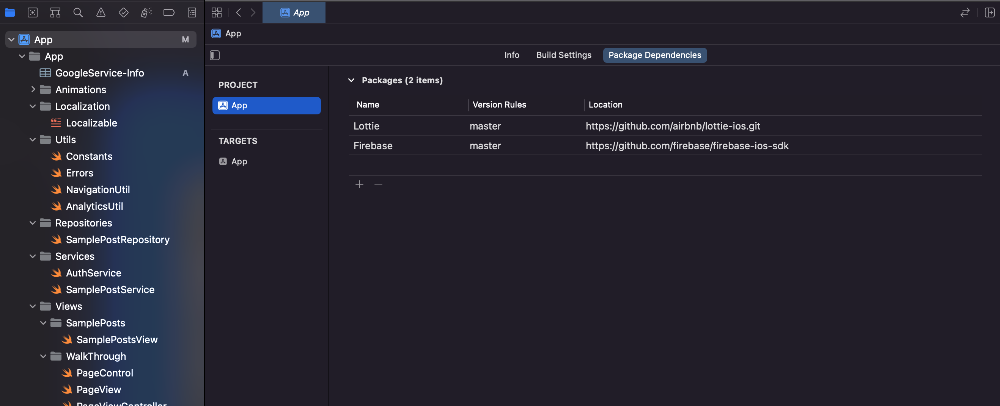

# SwiftUI + Firebase template project

This is a template project with SwiftUI and Firebase. You can create an iOS with SwiftUI and Firebase right away without spending time on backend development! :rocket:

Integrated Firebase services are following
- Firestore Database
- Firebase App Check
- Authentication
- Functions
- Analytics

This repository has implemented dark/light mode, too. The previous mode is cached in User defaults.

## Features

This app has the following code structure.

```
.
├── Animations                      # Lotties JSON files
├── Localization                    # Localization files (`*.strings`)
├── Utils                           # Utility functions 
├── Services                        # Service classes (business domain)
├── Repositories                    # Repository classes (data layer)
├── Views                           # View classes (view layer)
├── Extensions                      # Swift extension files
├── GoogleService-Info.plist        # Firebase config file (git ignored)
└── README.md
```

- This project sets up necessary service classes in `ContentView.swift` through `environmentObject`. View files that need to access services simply declare `@EnvironmentObject`, like `@EnvironmentObject var postService: SamplePostService`.
- `Views/Styles.swift` has a convenient view modifier called `.style(_)`. You can style Text like `Text("Hello world!").style(.header)`.
- This project employs [Lottie](https://github.com/airbnb/lottie-ios) for rendering animations. Please refer `Views/Common/LottieView.swift`.
- This project has integrated [Firebase Authentication](https://firebase.google.com/docs/auth) by default. You don't have to force users to explicitly sign up for using your app.
- This project has integrated [Firebase Firestore](https://firebase.google.com/docs/firestore). The UI of this project reflects the CRUD in real time. It is recommended to update the Firestore rules (see a following sample).
- This project has integrated [Firebase Analytics](https://firebase.google.com/docs/analytics). Please refer `Utils/AnalyticsUtil.swift`. If you call `AnalyticsUtil.logEvent(.something)`, this event will be recorded in Firebase Analytics.


Here is a sample of Firestore rule managed on Firebase Console. In this sample, `posts` has a user directory where only the owner can access. On the other hand, the second `something` is accessible for every logged-in users (anonymous login is fine).

```
rules_version = '2';
service cloud.firestore {
  match /databases/{database}/documents {
    match /posts/{userId}/{document=**} {
      allow read, update, delete: if request.auth != null && request.auth.uid == userId;
      allow create: if request.auth != null;
    }
    match /something/{document=**} {
      allow read: if request.auth != null;
    }
  }
}
```

## How to use

Just fork the repository on GitHub and go to "Create a new repository" page. You will find `swiftui-firebase-template` in the `Repository template` section! :smile:

Then you have to set up a Firebase project.

1. Clone your new repository to your local machine
2. Create a new Firebase project (Please enable Firebase Auth anonymous login and Firestore)
3. Add `GoogleService-Info.plist` in the new repository
4. Start adding your own implementation

If you see build errors, you may need to remove and re-add Swift Package dependencies.

Here are dependencies:
- [Lottie](https://github.com/airbnb/lottie-ios) version 4.x.y
  - To render animcation easily.
- [Firebase](https://github.com/firebase/firebase-ios-sdk) version 10.x.y
  - To handle Firebase services.



If you want to add some logic around database (Firestore), please refer to [this documentation](https://firebase.google.com/docs/functions)


## License

MIT
